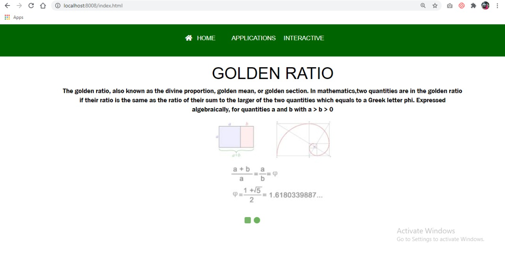
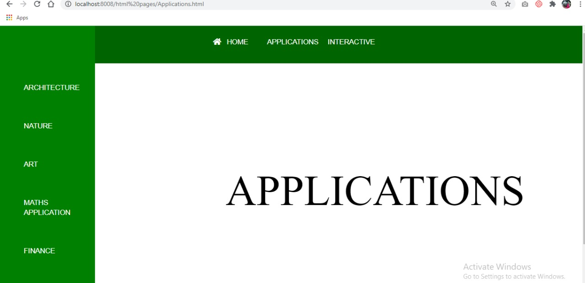
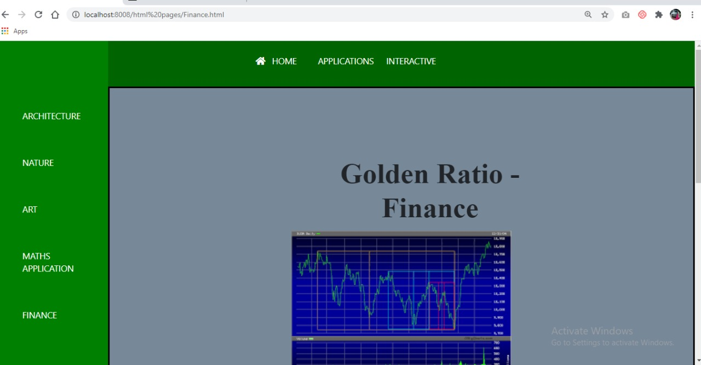
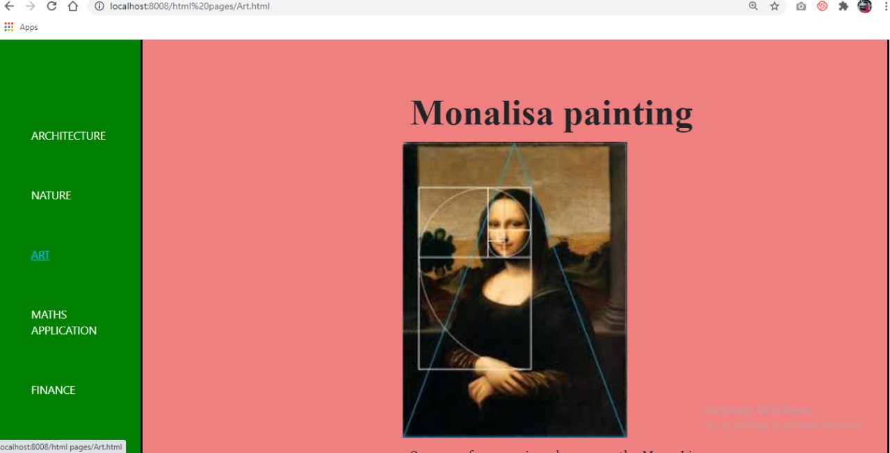
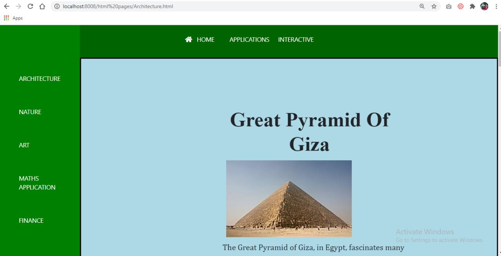
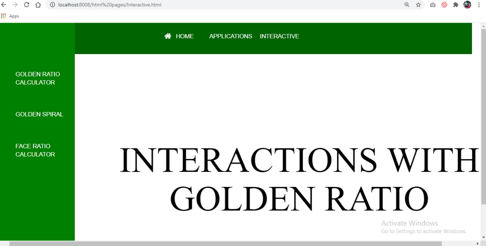
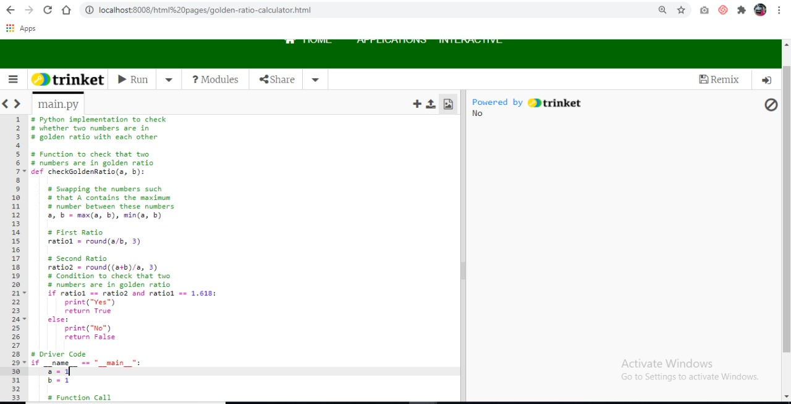
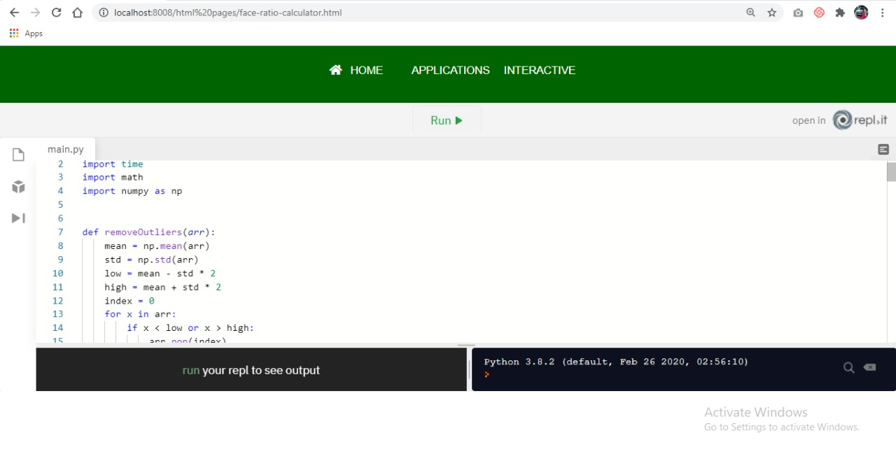

# Golden Tunnel
 I am the beginner in this field and after going through the subject and exploring this field. This is my Output. Hope you like it! 
## Installation
- Installation of NVM
1. First download the NVM installation script using cURL as follows
    
       curl -o- https://raw.githubusercontent.com/creationix/nvm/v0.34.0/install.sh | bash
    
2. After downloading the script, run the script using bash as follows
      
       bash install_nvm.sh
      
3. To reflect the changes for the current user session, use following command
       
       source ~/.profile
       
4. Check installed NVM version as follows

       nvm --version
       
5. Install a particular version of node
      
       nvm install 10.15

## Run the Application
1. Remove the package-lock.json
      
       rm package-lock.json
2. Install the dependencies
      
       npm install
3. Run the server
       
       node app.js 
- Application will be running at http://localhost:8008

## Working
- Home page has a menubar with components: Home, Applications(has a drop-down list),Interactive(has a drop-down list)
- Home page also consists of the basic information regarding Golden Ratio and images displayed as a slideshow.
- Applications Tab has the side bar along with menu bar showing the sub-pages in it
- Each application has a page with examples in pictorial and textual representation
- Interactive Tab has the side bar with its three web-pages
- Each interactive page shows different interactive ways of depicting golden ratio:
    - Golden ratio calculator takes two numbers from user and gives Yes/No of whether they are in golden ratio
    - Golden spiral, it is a python code which represents the golden spiral
    - Face ratio calculator shows the ratio in Monalisa's Painting (But, the code can be used for any image to calculate the ratio).

## Application Screenshots
1. Home Page
 
2. Applications Page 
 
    - Few tabs in Applications: 
    
    
    
3. Interactive Page
    
        - Few tabs in Interactive:
        
        
